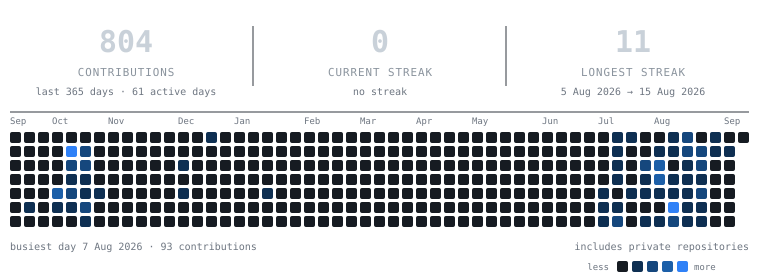

  

  

  
  
  
  
  

## Focus

- **Systems programming in Rust and C++, on Windows and Linux.** GPU frame
  capture, hardware video encoding, real-time audio pipelines, and the bounded
  in-memory ring buffers that let a recorder hold the last minute without
  touching the disk.
- **Native interfaces, no web stack.** Direct2D and DirectWrite on Windows,
  Qt Quick and QML, GTK4 on Linux, Ratatui in the terminal — picked so an idle
  application costs tens of megabytes instead of hundreds.
- **Platform APIs where the edges are sharp.** Windows Graphics Capture, D3D11,
  Media Foundation and WASAPI; Wayland and Hyprland, PipeWire, systemd user
  services, and Arch packaging on the other side.
- **Local-first by construction, not by policy.** No accounts, no telemetry, no
  upload path — the Linux recorder ships with network access denied in its unit
  file rather than merely unused.
- **Measured instead of asserted.** Memory and bitrate budgets are explicit and
  enforced, footprints are compared against real alternatives with the raw
  numbers published, and releases are validated end to end in a disposable
  Windows 11 VM.
- **Boring release discipline.** Locked workspaces, `clippy -D warnings` as a
  gate, native CI that builds and exercises the installer, and SHA-256 build
  evidence attached to every release.

## Featured Projects

<table>
  <tr>
    <td width="50%" valign="top">
      
      
Which desktop application is eating your memory, and what actually happened after you tried to stop it. GUI applications instead of every process on the machine, whole process trees totalled rather than a browser's root, and close-risk notes before you kill something.

      
<code>Rust</code> <code>Ratatui</code> <code>Linux</code> <code>TUI</code>

    </td>
    <td width="50%" valign="top">
      
      
A local-first ledger for your repositories: Git state, branches, recent commits and detected build systems, on the desktop and without an account or a network connection. Optional GitHub authorization is in progress.

      
<code>Rust</code> <code>GTK4</code> <code>Git</code> <code>Local-first</code>

    </td>
  </tr>
  <tr>
    <td width="50%" valign="top">
      
      
The last half minute of gameplay, hardware-encoded in memory and written out only when you press the shortcut. Native on Windows, a small service plus GTK4 library on Linux, and nothing ever leaves the machine.

      
<code>Rust</code> <code>Direct2D</code> <code>Media Foundation</code> <code>WASAPI</code> <code>GTK4</code>

      

        
        
      

    </td>
    <td width="50%" valign="top">
      
      
My Arch desktop: a QML shell with a vertical bar, Dynamic Island, launcher, dashboard, notifications, wallpaper tools, a lock screen and a cautious installer.

      
<code>QML</code> <code>Quickshell</code> <code>Hyprland</code> <code>Arch Linux</code> <code>Wayland</code>

    </td>
  </tr>
</table>

## Open Source Contributions

<table>
  <tr>
    <td width="50%" valign="top">
      
      
I contributed the Windows version only: native platform integration and the Windows installer packaging.

      
<code>Windows</code> <code>C++</code> <code>Qt</code> <code>CMake</code> <code>MSI</code> <code>NSIS</code>

    </td>
    <td width="50%" valign="top">
      
      
I contributed the Windows version only of this fast screenshot and annotation workflow.

      
<code>Windows</code> <code>Rust</code> <code>Screen Capture</code>

    </td>
  </tr>
</table>

## Stack

  

## GitHub in Numbers

  

  
  

  

  Rebuilt daily by <a href="scripts/build-stats.py">scripts/build-stats.py</a> — the hosted streak cards
  query GitHub with their own token and therefore only ever see public repositories.

  

  

