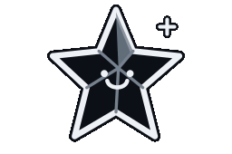

<h1 align="center">Mika</h1>

  <strong>Building local-first desktop tools, Linux workflows, and focused interfaces.</strong>

  

  
  I build open-source software close to the operating system: native desktop
  applications, Linux and Wayland integrations, developer tools, and the small
  services that connect them. My recent work spans instant replay capture,
  repository visibility, and a custom desktop shell—usually with Rust, C++, Qt,
  QML, or Python.

---

## Professional Focus

- Building local-first desktop software with small native footprints and clear
  privacy boundaries.
- Integrating tools deeply with Linux desktops, including Wayland, Hyprland,
  KDE Plasma, systemd user services, and hardware-accelerated media workflows.
- Turning complex system behavior into quiet interfaces with honest status,
  explicit platform support, and maintainable foundations.

---

## Featured Projects

<table>
  <tr>
    <td colspan="2" valign="top">
      <h3><a href="https://github.com/mika2go/Wreath">Wreath</a></h3>
      
Instant replay for Windows and Linux. It keeps the last half minute of gameplay hardware-encoded in memory and writes a clip only when you press the shortcut — no account, no upload, nothing leaves the machine. Native Direct2D interface on Windows, a small background service with a GTK4 clip library on Linux, and less than half the idle memory of the usual alternatives.

      
<code>Rust</code> <code>Direct2D</code> <code>Media Foundation</code> <code>WASAPI</code> <code>GTK4</code> <code>Wayland</code>

    </td>
  </tr>
  <tr>
    <td width="50%" valign="top">
      <h3><a href="https://github.com/mika2go/Trellis">Trellis</a></h3>
      
An open-source, local-first desktop repository ledger for Git state, recent activity, builds, tests, and optional forge attention—without requiring an account or cloud service.

      
<code>C++20</code> <code>Qt 6</code> <code>Qt Quick</code> <code>CMake</code> <code>Local-first</code>

    </td>
    <td width="50%" valign="top">
      <h3><a href="https://github.com/mika2go/dotfiles">Hyprland + Quickshell dotfiles</a></h3>
      
My Arch Linux desktop environment: a QML shell with a vertical bar, Dynamic Island, launcher, dashboard, notifications, wallpaper tools, lock screen, and a cautious installer.

      
<code>QML</code> <code>Quickshell</code> <code>Hyprland</code> <code>Arch Linux</code> <code>Wayland</code>

    </td>
  </tr>
</table>

---

## Open Source Contributions

<table>
  <tr>
    <td width="50%" valign="top">
      <h3><a href="https://github.com/mika2go/eddy">Eddy</a></h3>
      
I contributed only the Windows version, including native platform integration and Windows installer packaging.

      
<code>Windows</code> <code>C++</code> <code>Qt</code> <code>CMake</code> <code>MSI</code> <code>NSIS</code>

    </td>
    <td width="50%" valign="top">
      <h3><a href="https://github.com/mika2go/boltsnap">BoltSnap</a></h3>
      
I contributed only the Windows version of the fast screenshot and annotation workflow.

      
<code>Windows</code> <code>Rust</code> <code>Screen Capture</code>

    </td>
  </tr>
</table>

---

## Core Stack

  

---

## Activity

  

---

<em>Focused on useful software, thoughtful interfaces, and systems that make complex workflows feel simple.</em>

